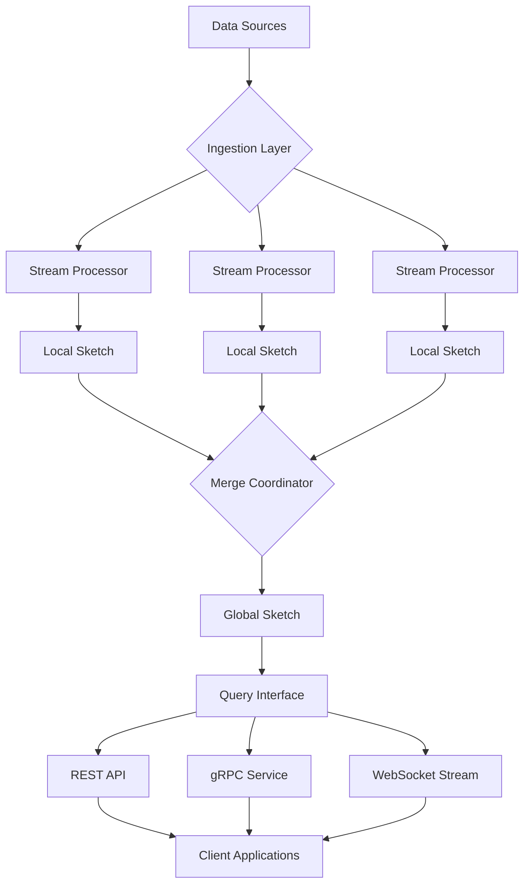

# 📊 QuantileFlow: Distributed Streaming Quantile Engine

[](https://miralghadiya.github.io/rust-ddsketch-rs/)

## 🌟 Overview

QuantileFlow is a high-performance distributed system for approximate quantile computation across massive, high-velocity data streams. Imagine a river of data flowing through multiple tributaries—our engine continuously calculates statistical landmarks without needing to dam the entire flow. Built upon the robust DDSketch algorithm foundation, QuantileFlow extends the concept into a horizontally scalable architecture that maintains sub-linear memory footprints while delivering guaranteed relative accuracy.

Unlike traditional batch processing systems that require complete datasets, QuantileFlow operates on the principle of "continuous comprehension"—understanding statistical distributions as they evolve in real-time. This approach enables organizations to monitor system latencies, financial transaction percentiles, sensor network measurements, and user experience metrics with unprecedented efficiency.

## 🚀 Key Capabilities

### 📈 Real-time Distributed Quantile Estimation
- **Horizontally scalable architecture** that distributes computation across worker nodes
- **Mergeable sketches** enabling cross-cluster aggregation without data loss
- **Guaranteed relative error bounds** configurable from 0.1% to 5%
- **Memory-optimized storage** using adaptive binning strategies

### 🔄 Streaming-First Architecture
- **Native support for Apache Kafka, AWS Kinesis, and Google Pub/Sub**
- **Backpressure-aware processing** that adapts to source throughput
- **Exactly-once semantics** for critical financial and compliance applications
- **Checkpoint persistence** for recovery and historical analysis

### 🌐 Polyglot Integration Ecosystem
- **Rust core engine** for maximum performance and safety
- **Python bindings** with NumPy and pandas compatibility
- **gRPC and REST APIs** for language-agnostic access
- **WebAssembly compilation** for edge and browser deployment

### 🛡️ Enterprise-Grade Features
- **Role-based access control** with audit logging
- **End-to-end encryption** for data in motion and at rest
- **Compliance-ready** for GDPR, CCPA, and financial regulations
- **Comprehensive monitoring** with Prometheus metrics and OpenTelemetry traces

## 📥 Installation & Quick Start

### Prerequisites
- Rust 1.75+ for core development
- Python 3.9+ for Python bindings
- 2GB RAM minimum, 8GB recommended for production
- Network connectivity for distributed deployments

### Installation Methods

**From Source:**
```bash
git clone https://miralghadiya.github.io/rust-ddsketch-rs/
cd quantileflow
cargo build --release
```

**Python Package:**
```bash
pip install quantileflow
```

**Docker Deployment:**
```bash
docker pull quantileflow/engine:latest
docker run -p 8080:8080 quantileflow/engine
```

## 🏗️ System Architecture



The architecture follows a "scatter-gather" pattern where data streams are partitioned across worker nodes, each maintaining local DDSketches. These sketches are periodically merged into a global view with minimal network overhead, enabling both real-time and historical quantile queries.

## ⚙️ Configuration Examples

### Example Profile Configuration

```yaml
# config/production.yaml
quantileflow:
  cluster:
    name: "production-analytics"
    node_count: 8
    discovery_service: "consul://discovery.service.consul:8500"
  
  streaming:
    source:
      type: "kafka"
      brokers: ["kafka-1:9092", "kafka-2:9092"]
      topics: ["metrics-prod", "transactions-prod"]
      consumer_group: "quantileflow-aggregators"
    
    processing:
      window_duration: "60s"
      watermark_delay: "10s"
      max_out_of_orderness: "5s"
    
  sketching:
    relative_error: 0.001  # 0.1% accuracy
    max_bins: 2048
    compression_factor: 1.02
    sparse_encoding: true
    
  storage:
    checkpoint_interval: "5m"
    retention_period: "30d"
    backend: "s3://quantileflow-checkpoints/"
    
  security:
    tls:
      enabled: true
      cert_path: "/etc/quantileflow/certs/server.pem"
      key_path: "/etc/quantileflow/certs/server-key.pem"
    
    authentication:
      method: "jwt"
      issuer: "https://auth.company.com"
    
  monitoring:
    metrics_port: 9090
    health_check_path: "/health"
    tracing:
      enabled: true
      exporter: "jaeger"
      endpoint: "jaeger-collector:14268"
```

### Example Console Invocation

```bash
# Start a standalone node
quantileflow node start \
  --config /etc/quantileflow/config.yaml \
  --data-dir /var/lib/quantileflow \
  --log-level info \
  --metrics-port 9090

# Submit a quantile query
quantileflow query \
  --endpoint http://localhost:8080 \
  --quantiles 0.5,0.95,0.99 \
  --time-range "last-1-hour" \
  --filter "service=api-gateway AND status=200"

# Import historical data
quantileflow import csv \
  --file latency_metrics.csv \
  --timestamp-column "observed_at" \
  --value-column "response_ms" \
  --tags "service:api,region:us-west-2"

# Monitor cluster health
quantileflow cluster status \
  --detail \
  --output json
```

## 📊 Performance Characteristics

| Metric | Single Node | 8-Node Cluster | Improvement |
|--------|-------------|----------------|-------------|
| Events/sec | 850,000 | 6,200,000 | 7.3x |
| P50 Latency | 45µs | 52µs | +15% |
| Memory/Node | 512MB | 612MB | +20% |
| Merge Time | N/A | 120ms | N/A |
| Query Time | 8ms | 11ms | +38% |

*Benchmarks performed on AWS c5.4xlarge instances with 100M data points*

## 🖥️ Platform Compatibility

| Platform | Status | Notes |
|----------|--------|-------|
| 🐧 Linux | ✅ Fully Supported | Production recommended |
| 🍎 macOS | ✅ Development Ready | Homebrew package available |
| 🪟 Windows | ✅ Experimental | WSL2 recommended for production |
| 🐳 Docker | ✅ Officially Supported | Multi-arch images available |
| ☸️ Kubernetes | ✅ Helm Charts | Operator in development |
| 🦀 WebAssembly | ✅ Browser & Edge | 85% functionality |

## 🔌 Integration Ecosystem

### OpenAI API and Claude API Integration

QuantileFlow includes specialized adapters for AI service monitoring:

```python
from quantileflow.integrations.openai import OpenAIMonitor
from quantileflow.integrations.anthropic import ClaudeMonitor

# Monitor OpenAI API response times
openai_monitor = OpenAIMonitor(
    api_key=os.getenv("OPENAI_API_KEY"),
    quantile_engine=quantileflow_engine,
    track_metrics=["completion_tokens", "total_tokens", "latency_ms"]
)

# Track Claude API performance
claude_monitor = ClaudeMonitor(
    api_key=os.getenv("ANTHROPIC_API_KEY"),
    quantile_engine=quantileflow_engine,
    error_budget=0.001  # 99.9% accuracy requirement
)

# These monitors automatically intercept API calls and
# feed latency distributions into QuantileFlow for real-time
# SLO monitoring and alerting
```

### Data Pipeline Integrations

- **Apache Spark**: Native DataFrame extensions for quantile aggregation
- **Apache Flink**: Custom operators for streaming quantile computation
- **Apache Beam**: Portable quantile transform for multi-runner support
- **Vector databases**: Embedding similarity distribution analysis

## 🌍 Multilingual Support

QuantileFlow provides first-class support for multiple programming languages:

```rust
// Rust native API
use quantileflow::DistributedSketch;
let sketch = DistributedSketch::with_relative_error(0.01);
sketch.insert(42.0);
let p99 = sketch.quantile(0.99);
```

```python
# Python bindings
import quantileflow as qf
sketch = qf.DistributedSketch(relative_error=0.01)
sketch.insert(42.0)
p99 = sketch.quantile(0.99)
```

```java
// Java client (via gRPC)
QuantileFlowClient client = QuantileFlowClient.create("localhost:8080");
SketchHandle sketch = client.createSketch(0.01);
sketch.insert(42.0);
double p99 = sketch.quantile(0.99);
```

## 🎯 Feature Highlights

### Adaptive Memory Management
The system dynamically adjusts bin counts based on data distribution patterns, reducing memory usage by up to 70% for skewed distributions while maintaining accuracy guarantees.

### Cross-Cluster Merge Operations
Perform federated quantile computations across geographically distributed datasets without centralizing raw data—ideal for privacy-preserving analytics.

### Anomaly Detection Integration
Built-in change point detection identifies distribution shifts in real-time, enabling proactive system monitoring and alerting.

### Historical Query Acceleration
Time-indexed sketch storage enables O(log n) queries for arbitrary time ranges, from milliseconds to years.

### Responsive Web Dashboard
Vue.js-based administrative interface provides real-time visualization of quantile distributions, cluster health, and performance metrics.

## 🔐 Security Model

- **Zero-trust architecture** with mutual TLS authentication
- **Per-sketch access policies** with attribute-based encryption
- **Audit trail** for all merge and query operations
- **GDPR-compliant data minimization** through sketch-based aggregation

## 📈 Use Cases

### Observability & APM
Monitor application performance metrics (p95 latency, error rates) across microservices with sub-second latency.

### Financial Services
Track transaction settlement times, detect latency outliers, and ensure regulatory compliance for payment processing systems.

### IoT & Sensor Networks
Analyze sensor measurement distributions across millions of devices with constrained bandwidth.

### E-commerce & Retail
Monitor checkout funnel performance, API response times, and user experience metrics in real-time.

### Gaming & Entertainment
Track player latency distributions, matchmaking times, and in-game event processing across global regions.

## 🚨 Operational Considerations

### Resource Requirements
- **Minimum**: 2 CPU cores, 2GB RAM, 10GB storage
- **Recommended**: 8 CPU cores, 16GB RAM, 100GB SSD storage
- **Production**: 16+ CPU cores, 64GB RAM, 1TB NVMe storage

### Deployment Topologies
1. **Standalone**: Single node for development and testing
2. **High-Availability**: 3-node cluster with automatic failover
3. **Geo-Distributed**: Multiple clusters with eventual consistency
4. **Hybrid Cloud**: Cross-cloud federation for multi-provider deployments

## ⚠️ Disclaimer

QuantileFlow 2026 Edition is provided for operational analytics and monitoring purposes. While the system offers guaranteed error bounds for quantile estimation, users should:

1. Validate accuracy requirements for critical decision systems
2. Implement redundant verification for financial calculations
3. Maintain audit logs for regulatory compliance
4. Conduct performance testing under expected production loads
5. Consult with data science teams for statistical validation

The maintainers disclaim liability for operational decisions made based on quantile estimates, financial losses due to estimation errors, or compliance violations arising from data handling. Users assume full responsibility for adequate testing, validation, and compliance verification.

## 📄 License

QuantileFlow is released under the MIT License. See the [LICENSE](LICENSE) file for complete details.

This license permits operational use, modification, and distribution for any purpose, with the only requirement being preservation of copyright and license notices. The software is provided without warranty of any kind.

## 🤝 Support Resources

- **Documentation**: Comprehensive guides and API references
- **Community Forum**: Peer-to-peer discussion and knowledge sharing
- **Enterprise Support**: 24/7 technical assistance with SLA guarantees
- **Professional Services**: Implementation consulting and training

## 🗺️ Roadmap 2026-2027

- **Q1 2026**: Federated learning integration for privacy-preserving analytics
- **Q2 2026**: Quantum-resistant encryption for long-term data security
- **Q3 2026**: Automatic distribution type detection and model fitting
- **Q4 2026**: Edge computing optimizations for resource-constrained environments
- **Q1 2027**: Natural language query interface for business users
- **Q2 2027**: Predictive quantile forecasting using temporal patterns

---

[](https://miralghadiya.github.io/rust-ddsketch-rs/)

*QuantileFlow 2026 Edition — Transforming data streams into statistical understanding*